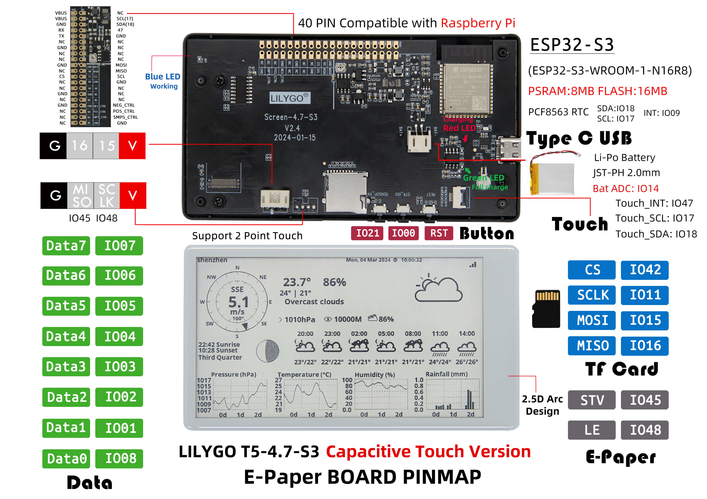
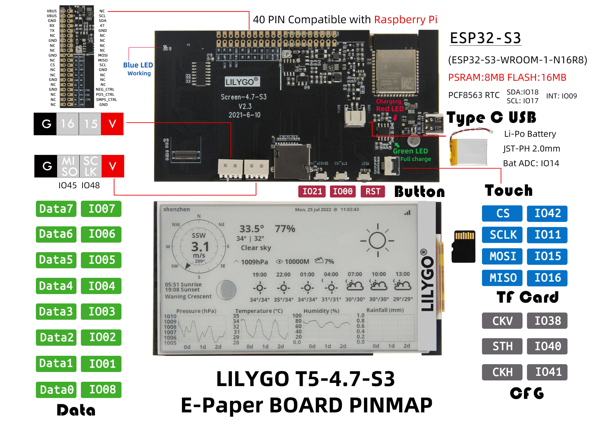

# LilyGo T5-ePaper-S3 4.7" Reference

Research date: 2026-05-16

This reference collects source links, local images, and observations for the `LilyGo T5-ePaper-S3 4.7"` desktop e-paper project.

## Local Reference Files

| File | What it shows |
|---|---|
| `docs/reference/lilygo_t5_47/official-product-front-back.jpg` | Official product image with front display module and rear PCB visible. |
| `docs/reference/lilygo_t5_47/official-touch-pinmap.jpg` | Official Touch V2.4 pinmap image, useful for connector/button/TF/USB-C placement. |
| `docs/reference/lilygo_t5_47/official-basic-pinmap.jpg` | Official Basic V2.3 pinmap image, useful for non-touch layout comparison. |
| `docs/reference/lilygo_t5_47/schematic-t5-epaper-s3-v2.3.pdf` | Official V2.3 schematic PDF from the LilyGo EPD47 repository. |

## Image Preview

## Source Links

| Source | Notes |
|---|---|
| [LILYGO official product page](https://lilygo.cc/products/t5-4-7-inch-e-paper-v2-3) | Product photos, purchase variants, official feature/spec list. |
| [Official LilyGo-EPD47 GitHub repository](https://github.com/Xinyuan-LilyGO/LilyGo-EPD47) | Firmware examples, board support table, Arduino/PlatformIO setup. |
| [Official schematic directory](https://github.com/Xinyuan-LILYGO/LilyGo-EPD47/tree/esp32s3/schematic) | V2.3/V2.4 schematic PDFs. |
| [Atomic14 EPD47 wiki notes](https://github.com/atomic14/diy-esp32-epub-reader/wiki/Epaper-Lilygo-EPD47) | Community measurements and practical notes. |

## Confirmed Specs

| Item | Value / observation | Source |
|---|---|---|
| Product | `T5-ePaper-S3`, 4.7 inch ESP32-S3 e-paper development board | Official product page / GitHub |
| MCU | `ESP32-S3-WROOM-1-N16R8` / `ESP32-S3R8` | Official product page / GitHub |
| Flash / PSRAM | `16MB` Flash, `8MB` PSRAM OPI | Official product page / GitHub |
| Display | 4.7 inch ultra-low-power e-paper, `ED047TC1` driver IC | Official product page |
| Resolution | `540 x 960` pixels, often used as landscape `960 x 540` | Official product page / GitHub |
| Gray levels | `16` | Official product page |
| Wireless | Wi-Fi, Bluetooth V5.0 | Official product page |
| RTC / battery | PCF8563 RTC, battery capacity detection | Official product page |
| Approx. board envelope | `11.4 x 6.3 cm`, about `4 mm` height including e-paper | Atomic14 wiki |
| Interface | Parallel e-paper data bus; optional touch version | Atomic14 wiki / official pinmap |

