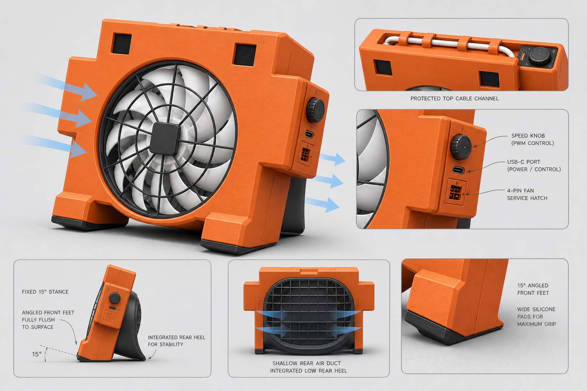
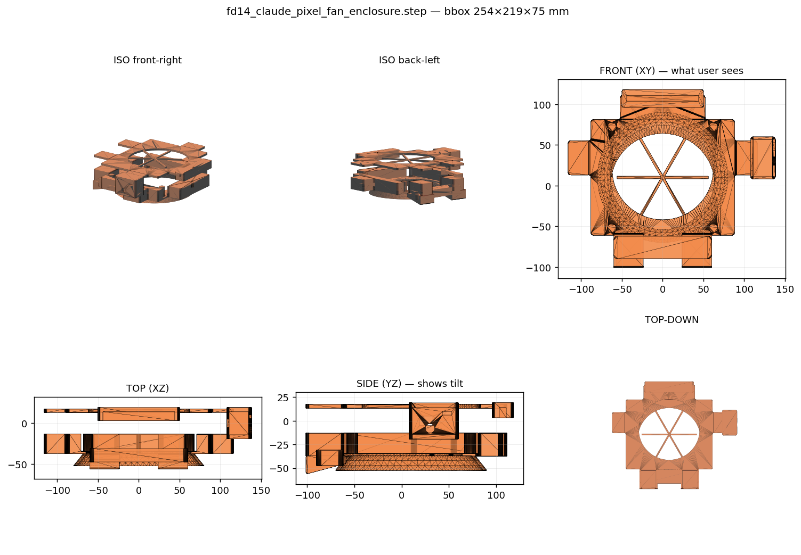
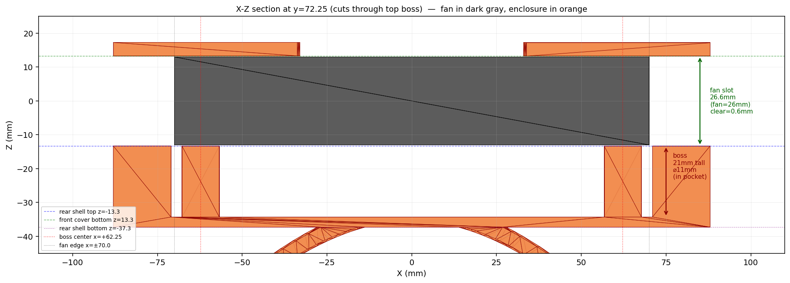

# FD14 Claude Code Pixel Fan Enclosure

为 DeepCool FD14 正向 140 mm 风扇设计的可 3D 打印外壳，外形参考 Claude Code 橙色像素小人：方头、黑色方眼、左右短臂、两条短腿。最终采用固定约 15° 仰角，不做可调支架。

## 最终设计方向

- **正面轮廓**：像素小人形态，橙色主体 + 头顶凸台 + 左右短臂 + 两只短腿。
- **风扇安装**：140 mm 风扇嵌在主体中央，大圆形开口，四角螺丝柱。
- **风道**：前后贯通，后壳做浅喇叭导流罩，不包死风扇。
- **固定角度**：底部两只腿的脚垫为固定 15° 斜切面，桌面自然仰吹。
- **稳定方式**：宽前脚 + 后部一体尾托形成三点支撑，不用后撑杆。
- **顶部线槽**：风扇顶部出线进入头顶凸台的下开口凹槽，避免线束跨扇叶。
- **控制区**：右肩集成控制舱，侧面露 USB-C 与旋钮，4-pin 接口留检修盖。

最终方向参考：

## 设计迭代

| # | 方向 | 结果 |
| --- | --- | --- |
| 01 | [初始三方案](refs/concept-01-initial-options.png) | 探索期 |
| 02 | [可调支架](refs/concept-02-adjustable-stand.png) | 复杂度过高，放弃 |
| 03 | [像素小人外形](refs/concept-03-pixel-robot.png) | 确定整体造型 |
| 04 | [宽后撑板](refs/concept-04-wide-rear-support.png) | 外观太重，放弃 |
| 05 | [楔形脚](refs/concept-05-wedge-feet.png) | 最终方案基础 |
| 06 | [固定 15°](refs/concept-06-fixed-15deg.png) | **采用** |

预览与剖面：

## 关键尺寸

当前 STEP 按通用 140 mm PC 风扇估算：

| 参数 | 数值 |
| --- | --- |
| 风扇外框 | 140 × 140 mm |
| 风扇厚度 | 26 mm |
| 安装孔距 | 124.5 × 124.5 mm |
| 螺丝孔直径 | 4.5 mm |
| 中央开口直径 | 132 mm |
| 外壳主体宽度 | 176 mm |
| 外壳主体高度 | 156 mm（含头顶凸台 142+ 凸台） |
| 头顶线槽凸台 | 104 × 32 mm |
| 固定仰角 | 15° |

实物打样前建议实测：FD14 四角孔径与孔距、风扇顶部出线口位置、4-pin 插头尺寸、PWM 小板尺寸与旋钮/USB-C 中心高度。

## 打印参数

- 壳体壁厚 1.8–2.0 mm，加强筋 1.2–1.6 mm
- 材料：PLA+ / PETG（主体）+ 黑色 PETG/TPU（脚垫与鞋跟）
- 鞋跟/脚垫：本身用深色材料打印；防滑可后贴硅胶条
- 层高 0.2 mm，外圈 3，顶/底层 4–5

### 各零件打印方向（推荐）

| 零件 | 朝向（朝下面） | 是否需要支撑 |
| --- | --- | --- |
| `front_cover` | **正面朝下**（眼睛+肋朝下，平整背面朝上） | 否；肋自然支撑在打印床 |
| `rear_shell` | **风道喇叭朝上**（后壳背面朝下） | 风扇舱悬空段需 tree 支撑 |
| `top_spine` | **凹槽开口朝上**（5 mm 盖朝下） | 否 |
| `control_pod` | **检修口朝上**（开放面朝上） | 否 |
| `wedge_feet` | **斜面朝下**（即 15° 接触面贴床） | 否；斜面会自动作为第一层 |
| `rear_heel` | **斜面朝下**（同 wedge_feet） | 否 |

## 装配

### 螺丝清单

| 部位 | 规格 | 数量 |
| --- | --- | --- |
| 风扇主夹固（前盖→风扇→后壳柱） | **M4 × 40 mm 自攻** | 4 |
| 备选：热熔铜螺母 + 标准螺丝 | M4 × 35 mm + M4 内嵌螺母 | 4 |
| 控制舱/脚垫/鞋跟 紧固（可选，亦可用环氧胶） | M3 × 12 mm 自攻 | 6–8 |

> `make_step.py` 中 `boss_tap_dia = 3.4` 适合自攻 M4。若改用热熔铜螺母，把它改为 5.7 再重生 STEP。

### 步骤

1. 把 FD14 风扇放入 `rear_shell` 的方形腔，四角孔位对齐螺丝柱。
2. 风扇出线穿过后壳前面凹槽（cable conduit）→ 沿头部上爬 → 进入 `top_spine` 下凹槽 → 由 `top_spine` 5 mm 盖隐藏。
3. `front_cover` 扣到 `rear_shell` 前面，四颗 M4 × 40 自攻从前往后拧入。
4. `top_spine` / `control_pod` / `wedge_feet` / `rear_heel` 用环氧或 M3 螺丝固定到 `rear_shell`。

### 三点支撑

`wedge_feet` 两只 + `rear_heel` 一只共同决定 15° 仰角桌面平面。三个底面同处一个倾斜平面（`make_step.py` 中 `desk_z(y)` 函数定义），不要单独修改任一脚的 z。

坐标系（见 `cad/make_step.py`）：
- +Z = 正面（观察者 / 出风方向）
- +Y = 头部方向，-Y = 腿部方向
- +X = 右侧（控制舱），-X = 左侧

### 美化建议

- **眼睛**：盲腔深 2 mm，可在打印时做 filament swap，最上 2 mm 换黑色；或后涂黑色丙烯/亚克力。
- **风扇前盖中心**：除了 6 根辐条 + 圆环，还加了 r=8 mm 中心毂，既支撑又可贴 logo 圆贴。

## 文件

- `cad/make_step.py` —— CadQuery 参数化建模脚本，重新生成请运行此文件
- `cad/fd14_claude_pixel_fan_enclosure.step` —— 完整装配
- `cad/parts/*.step` —— 6 个独立零件：`front_cover` / `rear_shell` / `top_spine` / `control_pod` / `wedge_feet` / `rear_heel`
- `docs/refs/*.png` —— 概念迭代图与渲染预览
